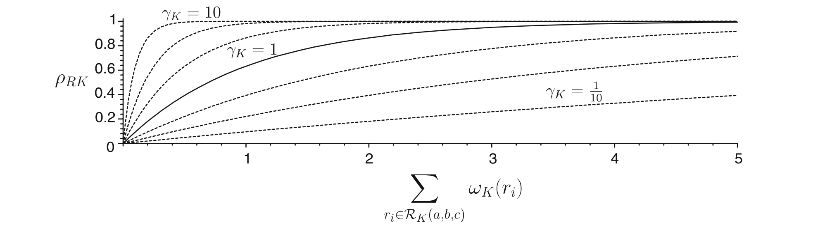
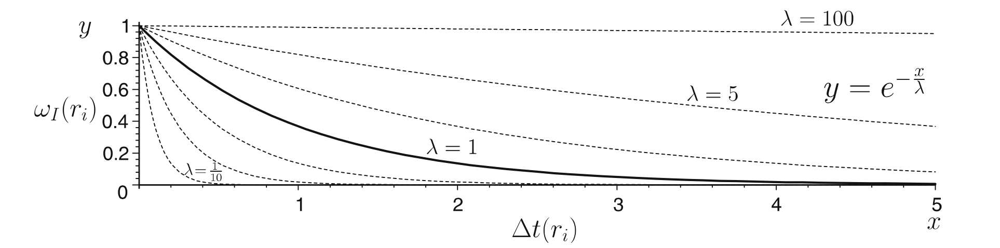
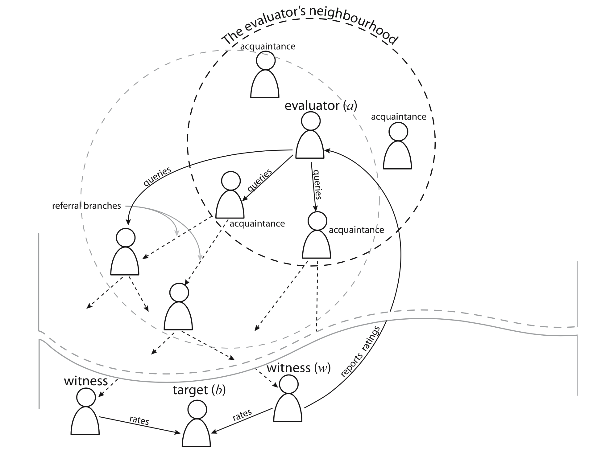

# Overview

1. Terminology
2. The FIRE Model
3. Results
4. Conclusions

---

# .. an open MAS?

> “...systems in which agents can freely join and leave at any time and where the agents are owned by various stakeholders with different aims and objectives.”

. . .

This causes some uncertainties:

1. Agents tend to be self-interested and may be unreliable
2. No agent can know everything about the environment
3. No central authority can control everything

---

# Sources of trust/reputation

| Source                 | Type                 |
|:-------------          |:-------------        |
| Direct experience      | Interaction trust    |
| Witness experience     | Witness reputation   |
| Role-bases rules       | Role-based trust     | 
| Third-party references | Certified reputation |

---

# Fire

Uses all four sources of information

Works, based on the following assumptions:

* Agents are willing to share their experiences with others (as witnesses or as referees)
* Agents are honest in exchanging information with one another.

. . .

So… we do not consider the problem of lying and inaccuracy.

---

# How to quantify trust/reputation? - The old way

Just take the average of all the ratings.

. . .

However... these ratings are not equally relevant: 

* Older ratings might not be as relevant as new ones
* Some ratings are more credible than other depending on the source

So in what other way can we quantify trust?

---

# How to quantify trust? - The FIRE way

Every rating is a tuple $r = (a,b,c,i,v)$.

Where $a$ and $b$ are the agents participating in transaction $i$. Value $v \in [-1, +1]$ is the rating given by agent $a$ to agent $b$ regarding regarding topic $c$ (e.g. quality, honesty).

These ratings are stored in the agent's local database. 

. . .

Since ratings become outdated over time, an agent only stores the latest $H$ transactions it gave to other agents.

---

# How to quantify trust? - Trust value $\mathcal{T}_K$

Use a rating weight function (reliability function) $\omega_K$ for every type of trust, where $K \in \{I,R,W,C\}$.

. . .

This gives us:

\begin{equation} 
\mathcal{T}_K(a,b,c) = 
\frac{\sum\nolimits_{r_i \in \mathcal{R}_K(a,b,c)} \omega_K (r_i) \cdot v_i}
{\sum\nolimits_{r_i \in \mathcal{R}_K(a,b,c)} \omega_K (r_i)} 
\end{equation}

* $\mathcal{T}_K(a,b,c)$ is the trust value of agent $a$ towards agent $b$ on topic $c$, regarding $K$.
* $\mathcal{R}_K(a,b,c)$ are the ratings collected on $K$.
* $\mathcal{T}_K(a,b,c) \in [-1, +1]$

---

# How to quantify trust? - Reliability

* We now have a trust value $\mathcal{T}_K$
* How reliable is $\mathcal{T}_K$?

. . .

* We need a value to express how reliable the calculated trust value $\mathcal{T}_K$ is!

---

# How to express reliability?

* We know how to calculate how reliable each individual rating is: $\omega_K$
* We use this to express:
    * Rating reliability $\rho_{RK}$: The total reliability of the individual ratings.
    * Deviation reliability $\rho_{DK}$: The higher the variance in the ratings is, the more volatile the agent is likely to fulfilling its agreements. 

---

# How to express reliability? - Rating reliability

* The total reliability of the individual ratings. $\rightarrow$ The sum of reliability of the individual ratings.

\begin{equation} \rho_{RK}(a,b,c) = 1 - exp\bigg( -\gamma_K \Big( \sum\nolimits_{r_i \in \mathcal{R}_K(a,b,c)} \omega_K (r_i) \Big) \bigg) \end{equation}

---

# How to express reliability? - Deviation reliability

* The higher the variability in the ratings is, the more volatile the agent is likely to fulfilling its agreements. 
* $\rightarrow$ The higher the variability the lower the deviation reliability is.

\begin{equation}
\rho_{DK}(a,b,c) = 1 - \frac{1}{2} \cdot 
\frac{\sum\nolimits_{r_i \in \mathcal{R}_K(a,b,c)} \omega_K (r_i) \cdot |v_i-\mathcal{T}_K(a,b,c)|}{\sum\nolimits_{r_i\in \mathcal{R}_K(a,b,c)} \omega_K (r_i)}
\end{equation}

---

# How to express reliability?

* Now we know how to calculate both the rating reliability $\rho_{RK}$ and deviation reliability $\rho_{DK}$. 

* We combine both values and get a single value for the reliability of $\mathcal{T}$:

\begin{equation}
\rho_K(a,b,c) = \rho_{RK}(a,b,c) \cdot \rho_{DK}(a,b,c)
\end{equation}

---

# Interaction trust

* Is built from the direct experiences of an agent and models the direct interactions between two agents. 
* The reliability $\omega_I(r_i)$ of a single interaction is determined by its recency:
\begin{equation}
\omega_I(r_i) = exp\bigg( - \frac{\Delta t(r_i)}{\lambda} \bigg)
\end{equation}
* $\Delta t(r_i)$ is the difference in time between now and the time when $r_i$ was recorded.
* $\lambda$ is the recency scaling factor.

---

# Interaction trust

---

# Role-based trust

* Models trust resulting from role-based relations.
* For example: provider-consumer relationship.
* The reliability $\omega_R(r_i)$ of a single interaction is determined by a set of rules:
\begin{equation}
rule = (role_a, role_b, c, e, v)
\end{equation}
    * $v$ is the expected performance.
    * $e$ is the amount of influence this rule has on the total value.
* $\omega_R(r_i) = e_i$

---

# Witness reputation

* Is built on observations on the agents behavior by other agents.
* Need to find other agents that have interacted with $b$.
* This might be problematic in large environment:
    * Limited resources available;
    * Need to find these witnesses in reasonable time.
* Once all the ratings have been collected, the weight is determined by $\omega_W(ri) = omega_W(ri)$.
* Based on the idea of referrals.

---

# Witness reputation

---

# Certified reputation

* Is built from ratings from *certified references* given by *referees*.
* Stored by the agent itself and chooses which ratings to present.

. . .

* After every transaction, $b$ asks $a$ to give a certified rating.
* When $a$ contacts $b$, it asks $b$ for the te certified references.

* Since the ratings are from direct interactions, $\omega_C(r_i) = \omega_I(r_i)$.

---

# Putting it all together

* We weigh every $\mathcal{T}_K$ with $W_K$ to indicate its relevance and get the global trust value.
* We get $w_k$ from every given weight $W_K$: $w_k = W_K \cdot rho_K(a,b,c)$, from this we get:

\begin{equation}
\mathcal{T}(a,b,c) = 
\frac{\sum\nolimits_{K\in \{I,R,C,W\}} w_K \cdot \mathcal{T}_K(a,b,c) }
{\sum\nolimits_{K\in \{I,R,C,W\}} w_K}
\end{equation}

* Then the overall reliability becomes:

\begin{equation}
\rho_\mathcal{T}(a,b,c) = \frac{\sum\nolimits_{K\in \{I,R,C,W\}} w_K}{\sum\nolimits_{K\in \{I,R,C,W\}} W_K}
\end{equation}

---

# But this assumption...

> "Agents are honest in exchanging information with one another."

Isn't this in contradiction with what we want to achieve here?

---

# Without this assumption...
Third-party can of course be innacurate:
1. One person can see 'on-time good delivery' as an excellent service, but someone else can see this as 'satisfactory'.
2. You can deliberately provide false information about someone, to serve your own interests.

To fix this, they have extended the model...

---

# The Credibility Model

* Computes the credibility of a witness or a referee, based on the IT components in FIRE
* These measures are called the witness credibility and referee credibility
* The procedures of computing these measures are (almost) the same, I´ll show you witness credibility

---

# Witness Credibility

After having an interaction of agent *a* with *b*... 
1. *a* records its rating about *b*'s performance: *r*~a~

\begin{equation}

\end{equation}

# Summary

---

<!-- Local Variables:  -->
<!-- pandoc/write: beamer -->
<!-- pandoc/latex-engine: "xelatex" -->
<!-- pandoc/template: "beamer-template.tex" -->
<!-- End:  -->
